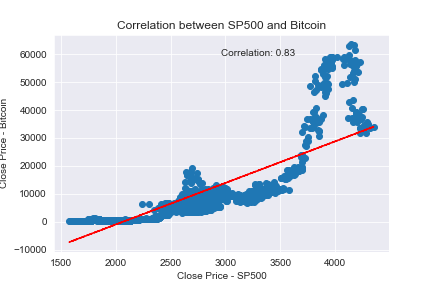
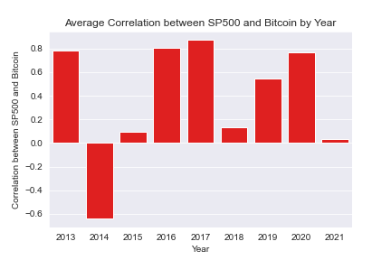
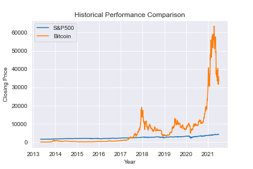
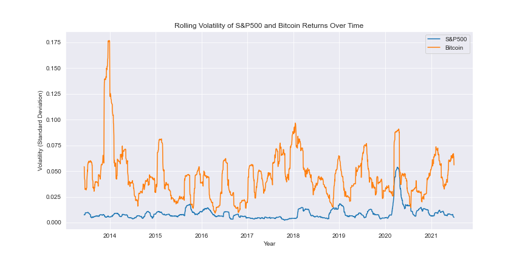
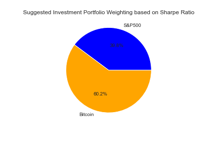

# Project2

The first part of this project required importing data about the S&P500 (The S&P 500 is an index of the 500 largest stocks in America)

I next found a CSV file with the price of Bitcoin (the largest and oldest cryptocurrency) over the last 10 years. 

I then went about cleaning both files (more details in my notebook). 

As part of the cleaning process I built a few cleaning functions. 

I formatted and cleaned both dataframes so that they could be merged effectively. 

Once I had a merged data frame with both S&P 500 and Bitcoin. I began data exploration. 

I looked at correlations, volatility and performance. 

Finally I created an optimal portfolio weighting of both assets, based on risk adjusted returns.

The entire journey is described in detail in my notebook and there are several interesting visaulisations. 

Here are a few highlights:

Correlation betwen S&P500 and Bitcoin

Average Correlation between SP500 and Bitcoin by Year

Historical Performance of Bitcoin vs S&P500 

Historical Volatility of Bitcoin vs S&P 500

Suggested Investment Portfolio Weighting based on Sharpe Ratio

